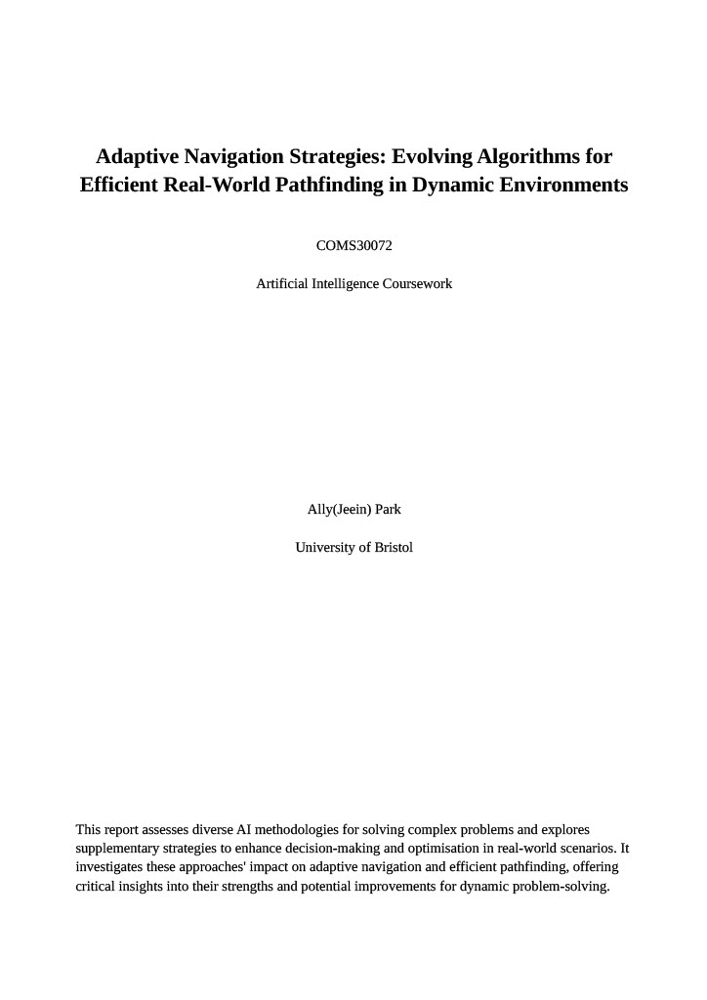
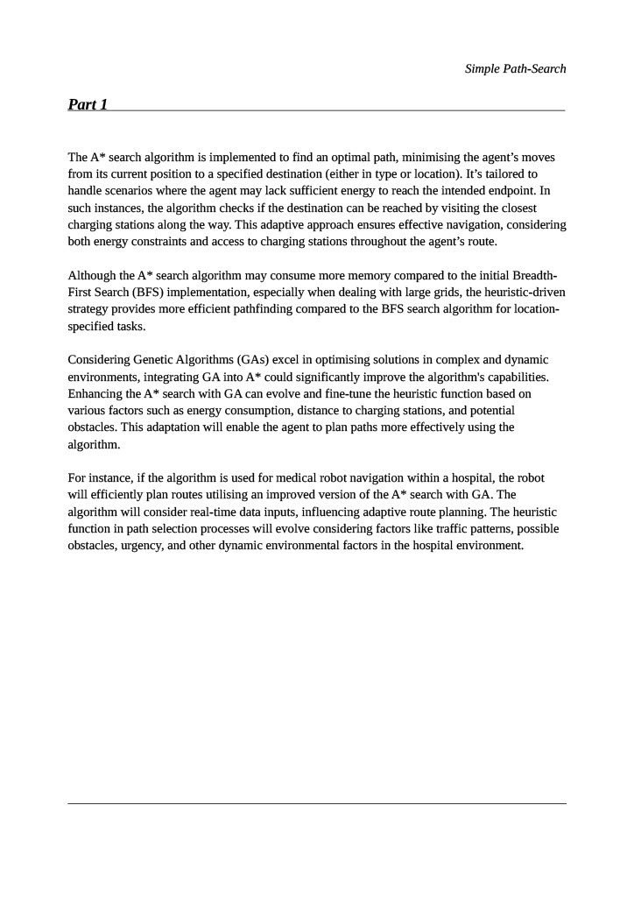
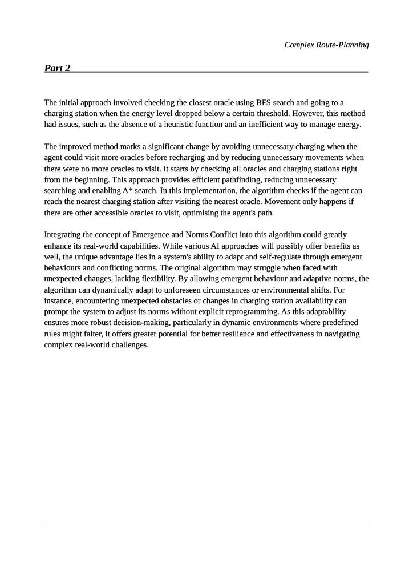
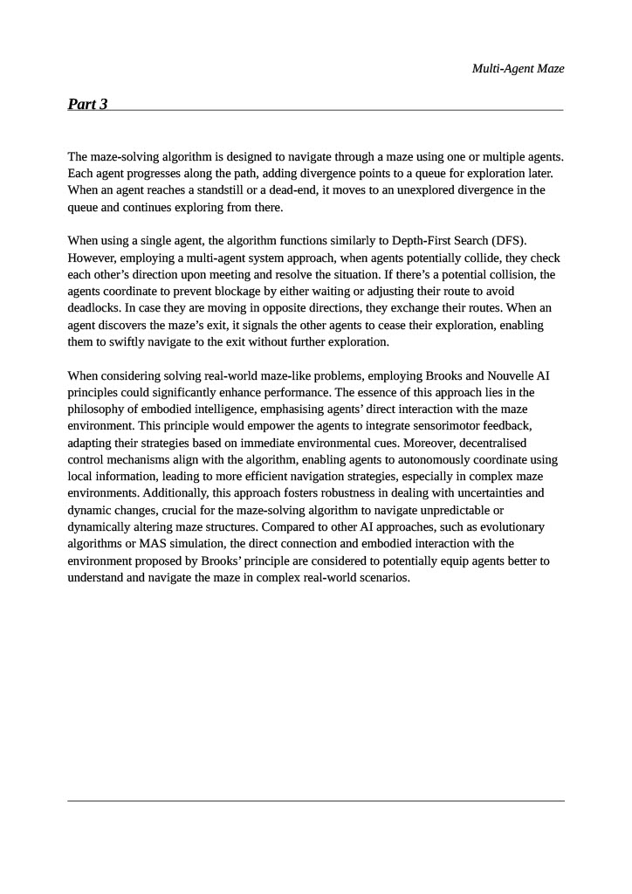
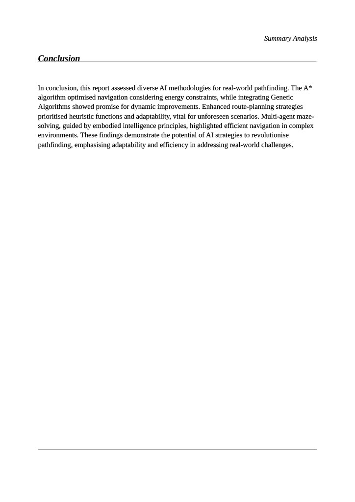

# Maze Solving AI with Efficient Pathfinding

## prolog_grid_world

**Project Duration:** November 2023 – December 2023

## Overview

This project focuses on developing an AI for solving maze problems on grids using pathfinding algorithms in Prolog. The AI is designed to efficiently navigate agents through various maze scenarios, optimising both pathfinding speed and memory usage.

## Features

- **Accelerated Pathfinding:** 
  - Implemented advanced pathfinding algorithms to speed up the process of finding optimal paths for agents in different maze configurations.
  - Optimised memory usage to handle complex scenarios efficiently.

- **Multi-Agent Utilisation:**
  - Enhanced maze-solving capabilities by utilising multiple agents simultaneously.
  - Effectively addressed edge cases where traditional single-agent approaches might fail.

- **Requirement:** SWI-Prolog is required to run this program.
  - Download and install SWI-Prolog by following the instructions on the official website:
    [SWI-Prolog Installation](https://www.swi-prolog.org/)
  

# Maze-Solving-AI

## Installation

### 1. Download and Extract the Project

- Download the project from the following link:
  [Maze-Solving-AI.zip](https://github.com/JeeIn-Park/Maze-Solving-AI/raw/main/Maze-Solving-AI.zip)
- Extract the contents of the ZIP file to your desired location on your machine.


### 2. Setting Up the Project

To run the project, follow the instructions for your operating system. Replace `N` with the part of the program you want to run (e.g., `part1`, `part2`, `part3`).


#### **Linux:**

1. Navigate to the library root folder containing the `ailp.pl` file:
   ```bash
   cd /path/to/library/root
   ```


2. Make the `ailp.pl` script executable (if it’s not already):
   ```bash
    chmod +x ailp.pl
    ```

  
3. Run the script with the desired part of the program:
   ```bash
    ./ailp.pl cw partN
   ```
   Replace `N` with the required part of the program (e.g., `part1`, `part2`, `part3`).
**Example Commands:**
- To run Part 1:
  - `./ailp.pl cw part1`
- To run Part 2:
  - `./ailp.pl cw part2`
- To run Part 3:
  -  `./ailp.pl cw part3`
 
  
4. Open GridWorld browser window:
   ```bash
    start. .
   ```
   Please note that you MUST hit "run" in the GridWorld browser window
   


#### **Windows:**

1. Open a `cmd` or `PowerShell` terminal, or double-click `ailp.pl` in an Explorer window.


2. Run the script using SWI-Prolog:
   ```bash
    swipl ailp.pl cw partN
   ```
   Alternatively, use:
   ```bash
    swipl-win ailp.pl cw partN
   ```
   Replace `N` with the required part of the program (e.g., `part1`, `part2`, `part3`).
**Example Commands:**
- To run Part 1:
  - `swipl ailp.pl cw part1` or `swipl-win ailp.pl cw part1`
- To run Part 2:
  -  `swipl ailp.pl cw part2` or `swipl-win ailp.pl cw part2`
- To run Part 3:
  -  `swipl ailp.pl cw part3` or `swipl-win ailp.pl cw part3`


3. Open GridWorld browser window:
   ```bash
    start. .
   ```
   Please note that you MUST hit "run" in the GridWorld browser window


### 3. Running the Project

The GridWorld library provides an interactive user shell to facilitate user interaction. You can invoke the shell with the following command:


- **Open the interactive shell:**
  ```bash
    shell.
  ```

  
#### **Available Shell Commands:**

- **Display Help:**
  ```bash
    help.
  ```

- **Exit the Interactive Shell:**
  ```bash
    stop.
  ```

- **Setup the Game:**
  ```bash
    setup.
  ```
  This command executes:
  '?- join_game(A), reset_game, start_game.'

- **Reset the Game:**
  ```bash
    reset.
  ```
  This command executes:
  '?- reset_game, start_game.'

- **Identify the Current Agent:**
  ```bash
    whoami.
  ```
  This command executes:
  '?- my_agent(A).'

- **Get Agent's Position:**
  ```bash
    position.
  ```
  This command executes:
 '?- my_agent(A), get_agent_position(A, P).'

- **Check Agent's Energy Level:**
  ```bash
    energy.
  ```
  This command executes:
  '?- my_agent(A), get_agent_energy(A, Energy).'

- **Top Up Agent's Energy:**
  ```bash
    topup(+Stat).
  ```
  This command executes:
  '?- my_agent(A), agent_topup_energy(A, Stat).'

- **Ask an Oracle a Question:**
  ```bash
    ask(+Orac, +Qu).
  ```
  This command executes:
  '?- my_agent(A), agent_ask_oracle(A, Orac, Qu, Ans).'

- **Execute a Prolog Goal:**
  ```bash
    call(+G).
  ```
  This command executes:
  '?- findall(G, call(G), L).'

- **Perform a Breadth-First Search (Lab Search):**
  ```bash
    search.
  ```
  This command executes:
  '?- search_bf.'

- **Solve a Task to Go to a Position (Part 1):**
  ```bash
    go(+Pos).
  ```
  This command executes:
  '?- solve_task(go(Pos), Cost).'

- **Solve a Task to Find an Object (Part 1):**
  ```bash
    find(+Obj).
  ```
  This command executes:
  '?- solve_task(find(Obj), Cost).'

- **Run a Demo Sequence (Part 1):**
  ```bash
    demo.
  ```
  This command executes:
  '?- reset, find(o(1)), ask(o(1), 'What is the meaning of life, the universe and everything?'),
     go(p(7,7)), energy, position, go(p(19,9)), energy, position,
     call(map_adjacent(p(19,9), _P, _O)), topup(c(3)), energy,
     go(p(10,10)), energy.'

- **Find the Identity of an Actor (Lab Identity, Part 2):**
  ```bash
    identity.
  ```
  This command executes:
  '?- find_identity(ActorName).'

- **Solve a Maze (Part 3):**
  ```bash
    maze.
  ```
  This command executes:
  '?- solve_maze.'


## Report

The project includes a detailed report that covers various aspects of the AI and its applications. Below are the different pages of the report:










